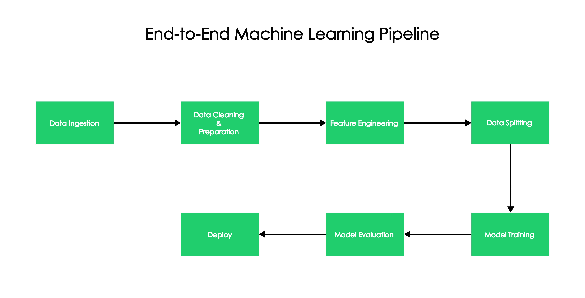
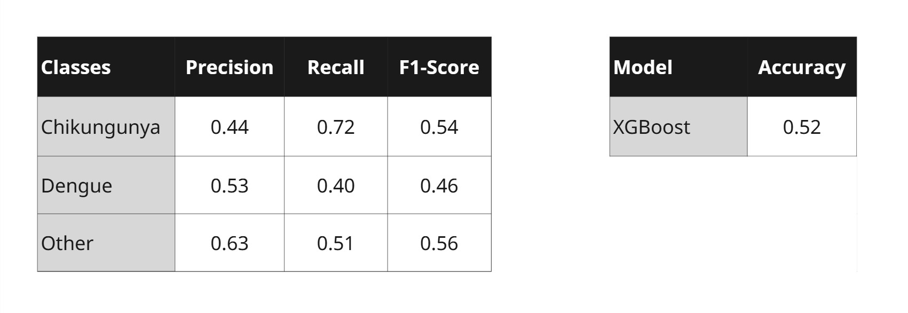

<p align="center">
  
</p>

<p align="center">
    
    
    
    <br>
    <a href="https://share.streamlit.io/user/pedroryandatadev"></a>
    <a href="https://www.figma.com/@pedroryandev"></a>
    <a href="https://github.com/pedroryandatadev"></a>   
</p>

The purpose of this project is to demonstrate the potential of artificial intelligence in public health, especially in supporting early diagnosis of endemic diseases. It does not replace a medical evaluation but can serve as an auxiliary tool for healthcare professionals and researchers.

> [!IMPORTANT]
> The form result is generated by a machine learning model and does not replace a medical evaluation.

<p align="center">
  
</p>

# Methodology

Arbovirus was developed following [IBM SPSS Modeler CRISP-DM Guide](https://www.ibm.com/docs/it/SS3RA7_18.3.0/pdf/ModelerCRISPDM.pdf), a widely used methodology for structuring Data Science and Machine Learning projects. By adopting CRIP-DM, the project became an excellent practical example of how each phase of the process contributes to building a robust and scalable solution.

<p align="center">
  
</p>

# Pipeline Machine Learning

Arbovirus was built using [IBM's Machine Learning Guide](https://www.ibm.com/think/topics/machine-learning-pipeline?), so it would be a great example to show how the architecture works in real-world projects.

<p align="center">
  
</p>

# Model Performance

- Accuracy: Measures the overall percentage of correct predictions.

- Precision: Measures how many of the items predicted as positive are actually positive.

- Recall (Sensitivity): Measures how many of the actual positive items were correctly predicted.

- F1-Score: Harmonic mean of precision and recall. Balances both metrics in a single score.

<p align="center">
  
</p>

# Model Configuration


### RandomUnderSampler

RandomUnderSampler is a technique used to deal with imbalanced datasets, where some classes appear much more than others.
It works by randomly reducing the number of examples of the majority class until the dataset is balanced with the minority class.

```
pipeline = Pipeline(steps=[
    ('undersample', RandomUnderSampler(random_state=42)),
    ('xgb', XGBClassifier(
        use_label_encoder=False,
        eval_metric='mlogloss'
    ))
])
```

### GridSearch

GridSearch is an exhaustive search technique used to find the best hyperparameters for a machine learning model.
It works by testing all possible combinations of parameters you define and evaluating the model's performance.

```
grid_search = GridSearchCV(
    estimator=pipeline,
    param_grid=param_grid,
    scoring='accuracy',
    cv=3,
    verbose=1,
    n_jobs=-1
)
```
# Data Source

Arbovirus using the [Government of the State of Pernambuco, Brazil](http://dados.recife.pe.gov.br/dataset/casos-de-dengue-zika-e-chikungunya) to obtain training data.<br>
The Government of the State of Pernambuco, Brazil provides a highly detailed data source with real data on patients.


# Requirements

Features Installation:

``` 
    pip install -r requirements.txt
```

# License

```
Development and design in 2025 by pedroryandatadev (Pedro Ryan)

This project has usage restrictions. See the LICENSE file for more information.
```